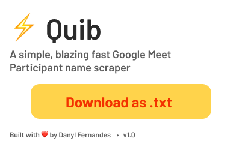

   

## Quib
A simple [1](#%EF%B8%8F-citations) , blazing fast Google Meet Participant name scraper

 

 
⚠️ Manual Installation
 ==================
 - I didn't want to pay the Chrome Web Store developer registration fee because I don't plan on being a Chrome Store dev. 
 - So the installation isn't as straightforward as installing it from the Chrome Store

 

🛠️ How to install
==================
- Download the .zip package & Extract it
- Open Google Chrome (or any browser that runs on chromium like Brave)
- In the browser's address bar type `chrome://extensions`
- Turn on Developer mode
- Select `Load Unpacked`
- Click the folder that you extracted
- Done!

🚀 Usage
========
- In an active Google Meet tab, activate the extension by clicking it
- Click the Download button and save the `.txt` file

🌄 Contribute to this project
=============================
1. Fork this repo (git clone https://github.com/gitryder/blitz.git)
2. Create a feature branch (git checkout -b a-new-feature)
3. Commit your work (git commit -am 'Add new feature')
4. Push to your branch (git push origin a-new-feature)
5. Create a shiny new Pull Request
6. Pat yourself on the back!

👨‍💻 Developer
===============
Built with ❤︎ by Danyl Fernandes
- Twitter (https://twitter.com/androidanyl)

✳️ Citations
============
1. Just has one button ;)

📑 License
==========
Copyright 2021 Danyl Fernandes

    Licensed under the Apache License, Version 2.0 (the "License");
    you may not use this file except in compliance with the License.
    You may obtain a copy of the License at

       http://www.apache.org/licenses/LICENSE-2.0

    Unless required by applicable law or agreed to in writing, software
    distributed under the License is distributed on an "AS IS" BASIS,
    WITHOUT WARRANTIES OR CONDITIONS OF ANY KIND, either express or implied.
    See the License for the specific language governing permissions and
    limitations under the License.

